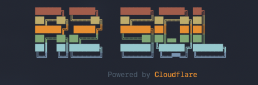
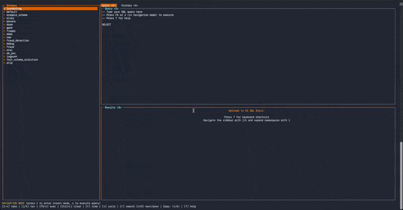

# R2 SQL Shell

<div align="center">



</div>

An interactive TUI (Text User Interface) for querying R2 Data Catalog using R2 SQL. Built with TypeScript and featuring vim-style keyboard navigation. UI inspiration from [rainfrog](https://github.com/achristmascarl/rainfrog) - an excellent SQL client with a beautiful TUI. When R2 SQL becomes more feature complete, there's a good chance I'll create a driver for rainfrog.

<div align="center">



</div>

## Features
- **Split-pane interface** with sidebar and main workspace
- **Vim-style navigation** with navigation/insert modes and h/j/k/l keys
- **Expandable tree view** for namespaces and tables
- **Tabbed interface** for query editor, history, and results
- **Keyboard shortcuts** for all operations (1-5, Ctrl+E, etc.)
- **Format options** hit `t` to cycle through list or table mode
- **Cycle through metadata** hit `v` to cycle through schema, results, headers, and latest Iceberg snapshot
- **filter/search** hit `/` to filter through the current view
- **copy/paste** hit `c` to copy as JSON and `m` to copy the result as a markdown formatted table
- **Syntax formatting** (Ctrl+F to format SQL)
- **Query history** with quick access (Alt+4)

## Prerequisites

- Node.js 18 or higher
- A Cloudflare account with:
  - An R2 bucket with R2 Data Catalog enabled
  - An API token with the following permissions:
    - R2 Data Catalog: Edit
    - R2 Object Storage: Edit
    - R2 SQL: Read

## Configuration

Create a `.env` file in the project root with your Cloudflare credentials:

```bash
cp .env.example .env
```

Edit `.env` and add your credentials:

```env
CLOUDFLARE_ACCOUNT_ID=your_account_id_here
R2_BUCKET_NAME=your_bucket_name_here
CLOUDFLARE_API_TOKEN=your_api_token_here
```

OR simply start `r2sql-shell` for the first time to set it up

### Getting Your Credentials

1. **Account ID**: Found in your Cloudflare dashboard URL or on the right side of the dashboard
2. **Bucket Name**: The name of your R2 bucket with Data Catalog enabled
3. **API Token**: Create one at https://dash.cloudflare.com/profile/api-tokens
   - Use the "Create Custom Token" option
   - Add the permissions listed above

## Installation

### Via Homebrew

**Option 1 (Recommended - One command):**
```bash
brew install marcinthecloud/r2sql-shell/r2sql-shell
```

**Option 2 (Tap first):**
```bash
brew tap marcinthecloud/r2sql-shell
brew install r2sql-shell
```

For publishing instructions, see [HOMEBREW_SETUP.md](HOMEBREW_SETUP.md).

### From Source

1. **Clone the repository**:
   ```bash
   git clone https://github.com/YOUR_USERNAME/r2sql-shell.git
   cd r2sql-shell
   ```

2. **Install dependencies**:
   ```bash
   npm install
   ```

3. **Build the project**:
   ```bash
   npm run build
   ```

4. **Install globally** (optional):
   ```bash
   npm link
   ```

   Now you can run `r2sql-shell` from anywhere!

### Download Pre-built Binary (Coming Soon)

Download the latest release for your platform from the [releases page](https://github.com/marcinthecloud/r2sql-shell/releases):
- macOS (Intel/Apple Silicon)
- Linux (x64)
- Windows (x64)

## Quick Start

### Option 1: Interactive Setup (Easiest)

Just run the command and you'll be prompted for your credentials:

```bash
r2sql-shell
# or if running from source:
npm start
```

### Option 2: Using Command-Line Arguments

```bash
r2sql-shell --account-id YOUR_ACCOUNT_ID --bucket YOUR_BUCKET --token YOUR_API_TOKEN
```

### Option 3: Using Environment Variables

Create a `.env` file:

```bash
cp .env.example .env
```

Edit `.env` with your credentials:

```env
CLOUDFLARE_ACCOUNT_ID=your_account_id_here
R2_BUCKET_NAME=your_bucket_name_here
CLOUDFLARE_API_TOKEN=your_api_token_here
```

Then run:

```bash
r2sql-shell
```

## Usage

### Command-Line Options

```bash
r2sql-shell [options]

Options:
  --account-id <id>        Cloudflare Account ID
  --bucket <name>          R2 Bucket Name
  --token <token>          Cloudflare API Token
  -e, --execute <query>    Execute a SQL query on startup
  --history [enabled]      Save query history to r2sql-history.txt (default: false)
  --debug                  Enable debug logging to r2sql-debug.log (default: false)
  --tui                    Use TUI mode (default)
  --simple                 Use simple REPL mode instead of TUI
  -h, --help               List of commands
  -V, --version            Output the version number
```

### Starting the Shell

```bash
# Start with interactive prompt for credentials
r2sql-shell

# Start in TUI mode with credentials
r2sql-shell --account-id YOUR_ID --bucket YOUR_BUCKET --token YOUR_TOKEN

# Execute a query on startup
r2sql-shell -e "SELECT * FROM my_namespace.my_table LIMIT 10"

# Enable query history logging
r2sql-shell --history

# Start in simple REPL mode
r2sql-shell --simple

# Combine options
r2sql-shell --account-id YOUR_ID --bucket YOUR_BUCKET --token YOUR_TOKEN \
      -e "SELECT * FROM default.logs LIMIT 5" --history
```

### First Time Setup

If your R2 bucket's Data Catalog is empty (no namespaces or tables yet), you'll need to:

1. Create Iceberg tables in your R2 bucket using tools like Apache Spark, Trino, or PyIceberg
2. Or wait until tables are created through your data pipeline

The shell will work once you have tables in the catalog. You can always test the connection with `node test-connection.js`.

### TUI Mode - Keyboard Shortcuts

The TUI mode features vim-style navigation and keyboard shortcuts:

#### Navigation
- `h` or `←` - Focus sidebar (schema tree)
- `l` or `→` or `Enter` - Expand/collapse namespace or select table
- `j` or `↓` - Move down
- `k` or `↑` - Move up
- `g` - Jump to top
- `G` - Jump to bottom

#### Modes
- `i` - Enter insert mode (when in query editor)
- `Esc` - Return to normal mode
- Normal mode: Navigate and use shortcuts
- Insert mode: Edit queries

#### Tabs
- `Alt+2` - Query editor
- `Alt+3` - Focus results pane
- `Alt+4` - Query history
- `Alt+5` - Favorites (coming soon)

#### Query Operations
- `Ctrl+E` - Execute current query (works in both normal and insert mode)
- `Ctrl+F` - Format SQL query
- Navigate to a table in the sidebar and press `Enter` to insert it into your query

#### Results View
- `t` - Toggle between table and list view
- Query metrics displayed at top of results (rows, execution time, bytes scanned, etc.)
- List view: Shows each row vertically (better for wide tables)
- Table view: Shows rows in a traditional table format (better for narrow tables)

#### Text Selection
- **Shift+Mouse** (or **Fn+Mouse** on Mac) - Select text to copy using your terminal's native selection
- Works in all panes including results, query editor, and history
- **Note**: Text selection is a terminal feature, not controlled by the app
- If selection doesn't work, check your terminal's settings:
  - **iTerm2**: Preferences → General → Selection → Enable "Applications in terminal may access clipboard"
  - **Terminal.app**: Should work by default with Fn+Mouse drag
  - **Alacritty**: May need to disable mouse reporting in config
  - Some terminals require holding modifier keys while dragging to select text

#### Other
- `r` or `R` - Refresh namespace list
- `?` - Show help screen
- `q` or `Ctrl+C` - Quit (in normal mode)

### Simple Mode - Interactive Commands

In simple mode, use these text commands:

```sql
-- Show help
.help

-- List all namespaces
SHOW NAMESPACES

-- List tables in a namespace
SHOW TABLES                    -- Lists tables in first namespace
SHOW TABLES my_namespace       -- Lists tables in specific namespace
SHOW TABLES IN my_namespace    -- Alternative syntax with IN keyword

-- Show table schema
DESCRIBE my_table

-- Exit the shell
.exit
quit
exit
```

### TUI Mode - Quick Start Guide

1. **Start the shell**: `npm start`
2. **Browse schemas**: Use `j`/`k` to navigate the sidebar
3. **Expand a namespace**: Press `l` or `Enter` on a namespace
4. **Insert a table**: Press `Enter` on a table name
   - Table name is inserted into the query editor
   - Table schema is displayed in the results pane
5. **Write query**: Press `i` to enter insert mode, edit your SQL
6. **Execute**: Press `Ctrl+E` to execute (works in any mode!)
7. **View results**: Query results and metrics appear at the top of the results pane
8. **Toggle view**: Press `t` to switch between table and list view
9. **View history**: Press `Alt+4` to see previous queries
10. **Format SQL**: `Ctrl+F` formats your query
11. **Copy text**: Hold `Shift` (or `Fn` on Mac) while selecting text with mouse
12. **Get help**: Press `?` for full keyboard shortcuts

### Running SQL Queries

In TUI mode, write queries in the editor and press `Ctrl+E`:

```sql
-- Simple SELECT (type in query editor, press Ctrl+E)
SELECT * FROM my_namespace.my_table LIMIT 10;
```
Remember to consult the current R2 SQL limitations 

In simple mode, just type and press Enter:

```sql
r2sql> SELECT * FROM my_namespace.my_table LIMIT 10;
```
## R2 SQL Limitations

R2 SQL has some limitations compared to standard SQL. Be aware of:

- Limited SQL feature set (no JOINs, subqueries, etc. in some cases)
- Read-only queries (SELECT only)
- Specific data type support

See the [R2 SQL documentation](https://developers.cloudflare.com/r2-sql/reference/limitations-best-practices/) for details.


## Development

```bash
# Install dependencies
npm install

# Build
npm run build

# Watch mode (rebuild on changes)
npm run watch

# Run after building
npm start
```

### Creating Executables

To package r2sql-shell as a standalone executable:

```bash
# Package for your current platform
npm run package

# Package for macOS only
npm run package:macos

# Package for Linux only
npm run package:linux

# Package for Windows only
npm run package:windows

# Package for all platforms
npm run package:all
```

Executables will be created in the `./bin` directory:
- `r2sql-shell-macos` (macOS)
- `r2sql-shell-linux` (Linux)
- `r2sql-shell-win.exe` (Windows)

**Distribution:**
- macOS users can run the binary directly after making it executable: `chmod +x bin/r2sql-shell-macos && ./bin/r2sql-shell-macos`
- Linux users can run: `chmod +x bin/r2sql-shell-linux && ./bin/r2sql-shell-linux`
- Windows users can double-click the `.exe` or run from PowerShell/CMD

**Note:** The executables are self-contained and include Node.js runtime - users don't need Node.js installed!

## Project Structure

```
r2sql-shell/
├── src/
│   ├── index.ts           # CLI entry point
│   ├── config.ts          # Configuration management
│   ├── types.ts           # TypeScript type definitions
│   ├── r2sql-client.ts    # R2 SQL HTTP API client
│   ├── iceberg-client.ts  # Iceberg REST catalog client
│   ├── formatter.ts       # Result formatting and charting
│   └── repl.ts            # Main REPL implementation
├── dist/                  # Compiled JavaScript (generated)
├── package.json
├── tsconfig.json
├── .env.example          # Example environment variables
└── README.md
```

## API References

- [R2 SQL Query API](https://developers.cloudflare.com/r2-sql/query-data/)
- [R2 SQL Reference](https://developers.cloudflare.com/r2-sql/sql-reference/)
- [R2 SQL Limitations](https://developers.cloudflare.com/r2-sql/reference/limitations-best-practices/)
- [Apache Iceberg REST API](https://iceberg.apache.org/docs/latest/rest-api/)

## Troubleshooting

### TUI Issues

If the TUI doesn't render correctly:

1. **Check terminal size**: Make sure your terminal is at least 100x30 characters
2. **Check terminal emulator**: Works best with modern terminals like iTerm2, Alacritty, or Windows Terminal
3. **Use simple mode**: If TUI has issues, try `npm start -- --simple`
4. **Color support**: Ensure your terminal supports 256 colors

### Common Issues

**"blessed.screen is not a function"**
- Run `npm install` to ensure all dependencies are installed
- Run `npm run build` to rebuild the project

**Keyboard shortcuts not working**
- Some terminal emulators may capture certain key combinations
- Try using alternative keys (e.g., if Alt+2 doesn't work, focus the query editor with `h` then `l`)

## Built With

- [TypeScript](https://www.typescriptlang.org/)
- [blessed](https://github.com/chjj/blessed) - TUI framework
- [chalk](https://github.com/chalk/chalk) - Terminal colors
- [cli-table3](https://github.com/cli-table/cli-table3) - Table formatting
- [asciichart](https://github.com/kroitor/asciichart) - ASCII charts
- [sql-formatter](https://github.com/sql-formatter-org/sql-formatter) - SQL formatting
- [commander](https://github.com/tj/commander.js) - CLI framework

## Contributing

Contributions are welcome! Please feel free to submit a Pull Request/Issues.

## License

MIT

## Acknowledgments

This project was built with [Claude Code](https://claude.com/claude-code), Anthropic's agentic coding tool. The development process and architecture decisions are documented in `CLAUDE.md`.

UI inspiration from [rainfrog](https://github.com/achristmascarl/rainfrog) - an excellent SQL client with a beautiful TUI. When R2 SQL becomes more feature complete, there's a good chance I'll create a driver for rainfrog. 
